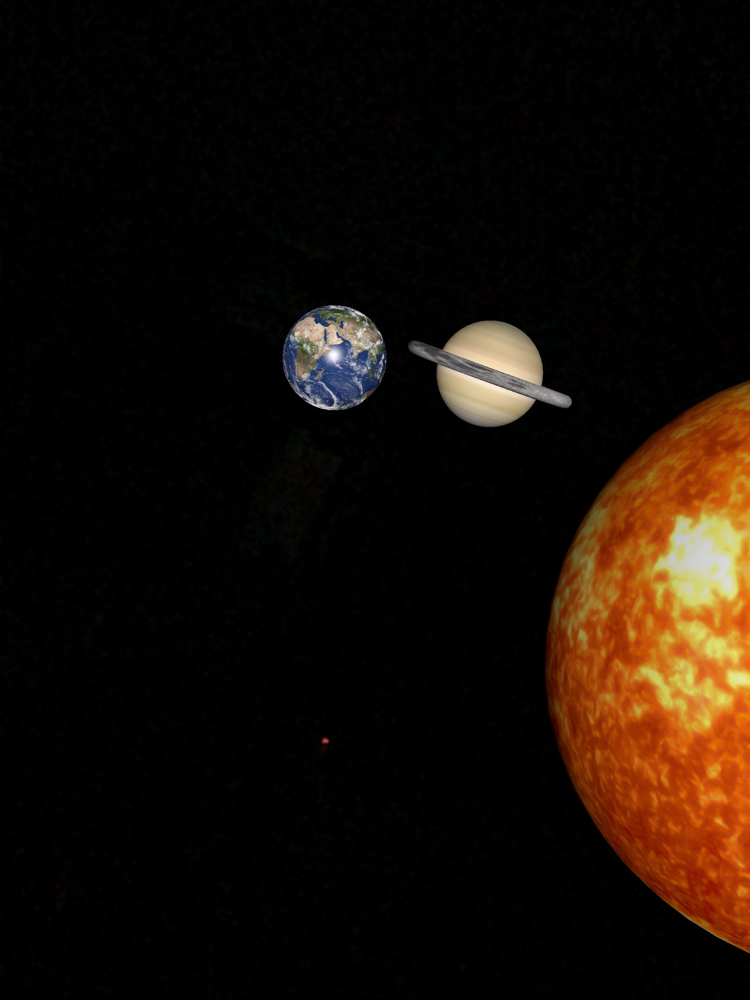

# AR-Solar-System
Our Solar System simulated in front of you with Augmented Reality. This project utilizes the Apple Developer's ARKit to manipulate a device's camera view.

Planet Bundle |  Detailed Earth | Saturn & Venus | Earth & Saturn
:----------:|:-------:|:-------:|:-------:
 |  |  | 

## Getting Started
### Prerequisites
- Xcode version ~9.0, ARKit is not available in earlier versions
- If you want to run the project on a device, you need an AR compatable apple device. The iPad pro, and the iPhone 6S and later versions are compatable. 
### Installation
1. clone this repo
2. open this project in Xcode
3. clean the project
4. connect a compatable device
5. build!
